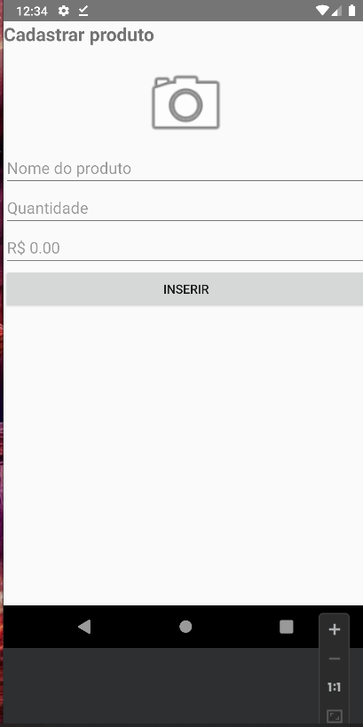

# Shopping List App

O **Shopping List App** é uma aplicação desenvolvida em Kotlin que permite aos usuários criar e gerenciar listas de compras. Os usuários podem adicionar itens à lista, especificando o nome, a quantidade, o preço e até mesmo adicionar fotos dos produtos desejados. Além disso, a aplicação calcula automaticamente o valor total das compras com base nos preços e quantidades dos itens.


## Funcionalidades

- Cadastro de itens com as seguintes informações:
  - Nome do item.
  - Quantidade desejada.
  - Preço unitário do item.
  - Foto do produto (opcional).

- Cálculo automático do valor total das compras com base nos preços dos itens e suas quantidades.

## Capturas de Tela


*Figura 1: Tela de cadastro de itens.*


*Figura 2: Tela exibindo a lista de itens cadastrados.*

## Pré-requisitos

Certifique-se de ter o ambiente de desenvolvimento Kotlin configurado em sua máquina.

## Executando o Projeto

1. Clone este repositório para o seu ambiente local:

```
 git clone git@github.com:C4rt00n3/shopping_lis.git
```

2. abra o projeto no androi estudio.

3. Click em run no android estudio.

